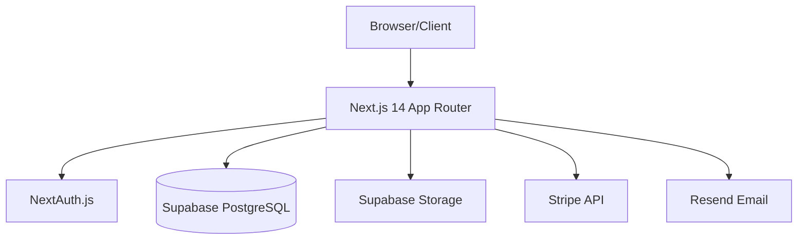
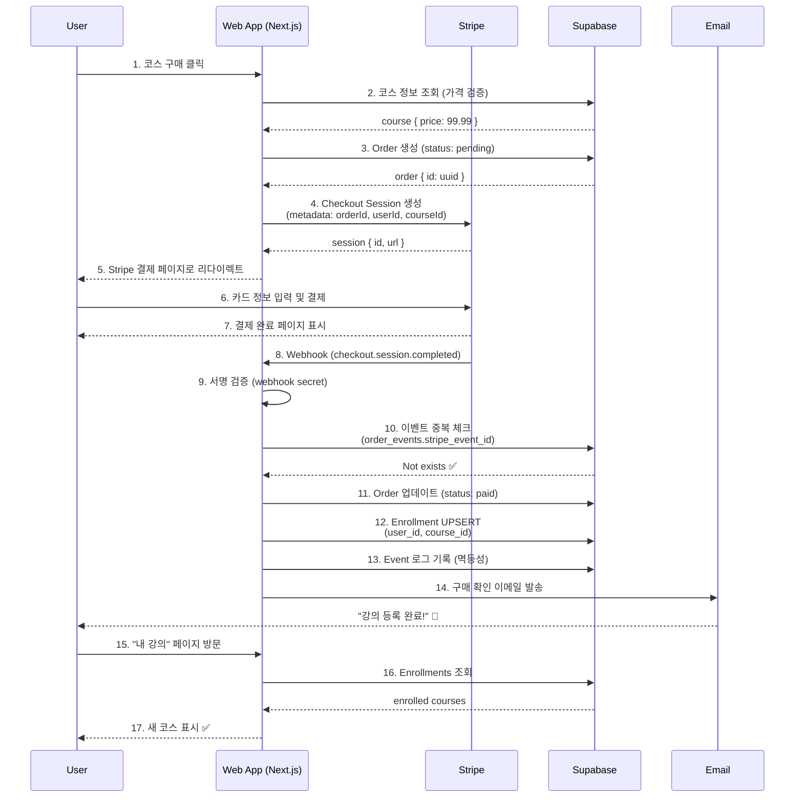
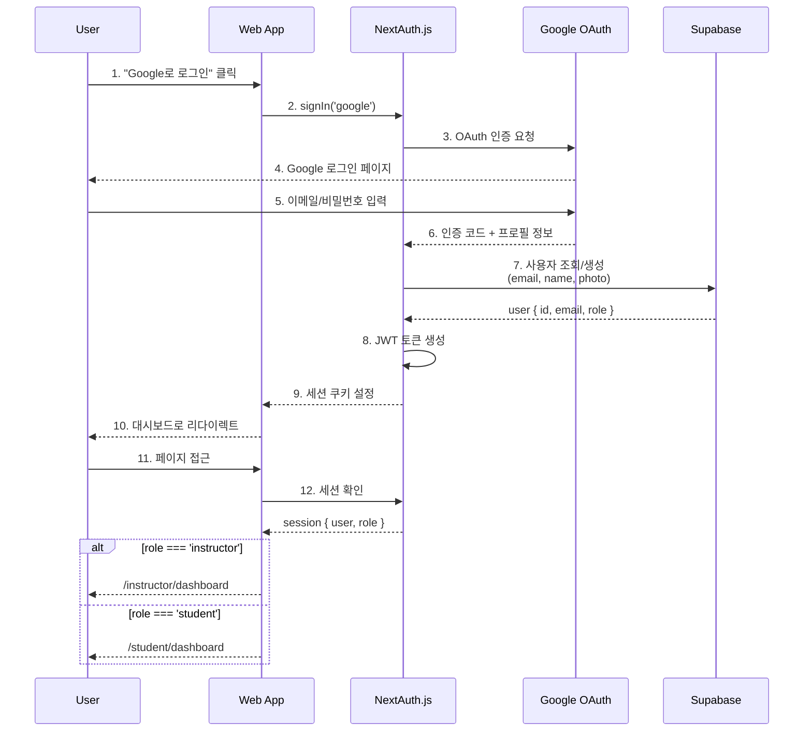
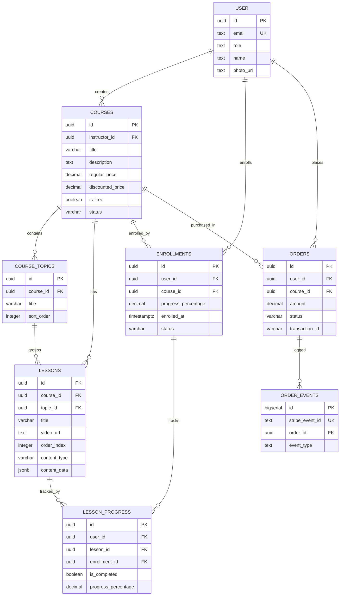
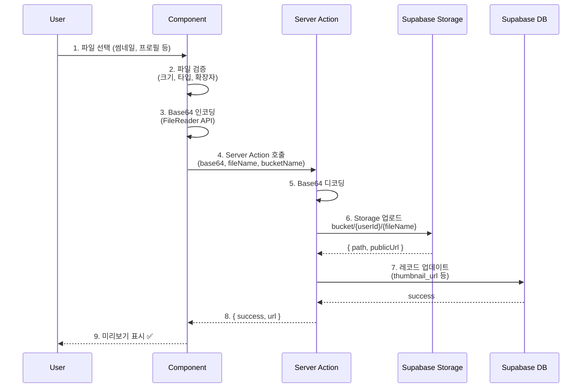
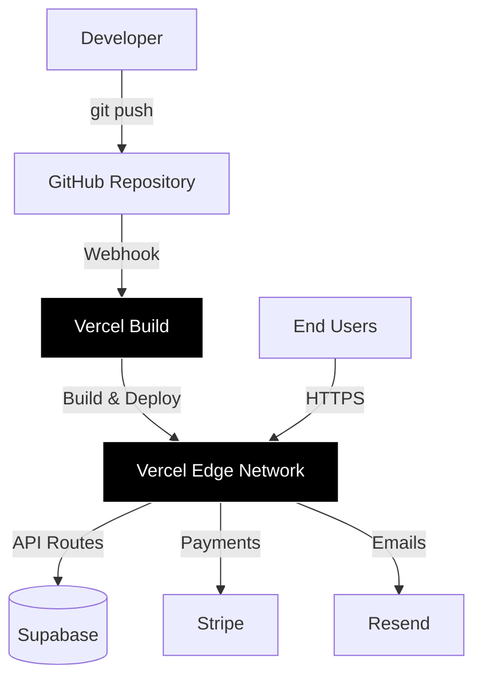

# DVS 시스템 아키텍처 설계

## 📋 개요

DVS (Digital Video School) 플랫폼의 전체 시스템 아키텍처와 주요 플로우를 설명합니다.

**최종 업데이트**: 2025-10-01
**담당**: 개발팀

---

## 🏗️ 시스템 구성

### 기술 스택



**프론트엔드**:
- Next.js 14 (App Router)
- TypeScript
- Bootstrap 5 + SCSS
- shadcn/ui (Admin)

**백엔드**:
- Next.js Server Actions
- Supabase (PostgreSQL + Auth + Storage)
- NextAuth.js (Google OAuth)

**외부 서비스**:
- Stripe (결제)
- Resend (이메일)
- Vercel (호스팅)

---

## 💳 결제 플로우 (Checkout → Enrollment)

### 전체 흐름



### 핵심 구현 포인트

#### 1. 금액 검증 (신뢰 근원은 DB)
```typescript
// ❌ 클라이언트에서 전달받은 금액 사용 금지
const amount = req.body.amount; // NEVER!

// ✅ 서버에서 DB 조회
const course = await getCourseById(courseId);
const amount = course.discounted_price || course.regular_price;
```

#### 2. 멱등성 보장
```typescript
// order_events 테이블로 중복 처리 방지
const existingEvent = await supabase
  .from('order_events')
  .select('id')
  .eq('stripe_event_id', event.id)
  .single();

if (existingEvent) {
  return new Response('Already processed', { status: 200 });
}

// 처리 후 이벤트 기록
await supabase.from('order_events').insert({
  stripe_event_id: event.id,
  order_id: orderId,
  event_type: event.type,
});
```

#### 3. UPSERT로 중복 등록 방지
```sql
-- enrollments 테이블 UNIQUE 제약
ALTER TABLE enrollments
ADD CONSTRAINT unique_user_course UNIQUE(user_id, course_id);
```

```typescript
// UPSERT 사용 (ON CONFLICT)
await supabase.from('enrollments').upsert({
  user_id: userId,
  course_id: courseId,
  status: 'active',
  enrolled_at: new Date().toISOString(),
}, { onConflict: 'user_id,course_id' });
```

---

## 🔐 인증 플로우

### Google OAuth + 세션 관리



### NextAuth 설정 요점

```typescript
// app/api/auth/[...nextauth]/route.ts
export const authOptions = {
  providers: [
    GoogleProvider({
      clientId: process.env.GOOGLE_CLIENT_ID!,
      clientSecret: process.env.GOOGLE_CLIENT_SECRET!,
    }),
  ],
  callbacks: {
    async signIn({ user, account, profile }) {
      // 1. Supabase에 사용자 생성/업데이트
      const { data, error } = await supabase
        .from('user')
        .upsert({
          email: user.email,
          name: user.name,
          photo_url: user.image,
          role: 'student', // 기본 역할
        }, { onConflict: 'email' })
        .select()
        .single();

      return true;
    },
    async session({ session, token }) {
      // 2. 세션에 역할 추가
      const { data: userData } = await supabase
        .from('user')
        .select('id, role')
        .eq('email', session.user.email)
        .single();

      session.user.id = userData?.id;
      session.user.role = userData?.role;

      return session;
    },
  },
};
```

---

## 🗄️ 데이터베이스 스키마

### 핵심 테이블 관계



### RLS (Row Level Security) 정책

```sql
-- ========================================
-- User 테이블: 본인 데이터만 조회
-- ========================================
CREATE POLICY "Users can view own profile" ON "user"
  FOR SELECT USING (auth.uid() = id);

CREATE POLICY "Users can update own profile" ON "user"
  FOR UPDATE USING (auth.uid() = id);

-- ========================================
-- Courses: 공개 코스는 모두 조회, 관리는 소유자만
-- ========================================
CREATE POLICY "Anyone can view published courses" ON courses
  FOR SELECT USING (status = 'published' AND is_public = true);

CREATE POLICY "Instructors manage own courses" ON courses
  FOR ALL USING (auth.uid() = instructor_id);

-- ========================================
-- Enrollments: 본인 수강 내역만 조회
-- ========================================
CREATE POLICY "Students view own enrollments" ON enrollments
  FOR SELECT USING (auth.uid() = user_id);

CREATE POLICY "System can insert enrollments" ON enrollments
  FOR INSERT WITH CHECK (true);  -- 서버 액션에서 처리

-- ========================================
-- Lesson Progress: 본인 진도만 관리
-- ========================================
CREATE POLICY "Students manage own progress" ON lesson_progress
  FOR ALL USING (auth.uid() = user_id);
```

---

## 📁 파일 업로드 플로우

### Supabase Storage 사용



### 구현 예시

```typescript
// utils/fileUpload.ts
export async function uploadFile(
  base64: string,
  fileName: string,
  bucketName: 'course-materials' | 'profiles' | 'attachments'
) {
  // 1. Base64 → Buffer
  const buffer = Buffer.from(base64.split(',')[1], 'base64');

  // 2. Supabase Storage 업로드
  const filePath = `${userId}/${Date.now()}_${fileName}`;
  const { data, error } = await supabase.storage
    .from(bucketName)
    .upload(filePath, buffer, {
      contentType: 'image/jpeg',
      cacheControl: '3600',
      upsert: false,
    });

  if (error) throw error;

  // 3. Public URL 생성
  const { data: { publicUrl } } = supabase.storage
    .from(bucketName)
    .getPublicUrl(filePath);

  return publicUrl;
}
```

### Storage Bucket 정책

```sql
-- course-materials: 공개 읽기
CREATE POLICY "Public Access" ON storage.objects
  FOR SELECT USING (bucket_id = 'course-materials');

-- profiles: 소유자만 관리
CREATE POLICY "Users manage own images" ON storage.objects
  FOR ALL USING (
    bucket_id = 'profiles' AND
    auth.uid()::text = (storage.foldername(name))[1]
  );
```

---

## 🔄 진도 추적 로직

### Lesson Progress 업데이트

```typescript
// 레슨 완료 시
async function markLessonComplete(userId: string, lessonId: string) {
  // 1. 레슨 진도 업데이트
  await supabase.from('lesson_progress').upsert({
    user_id: userId,
    lesson_id: lessonId,
    is_completed: true,
    progress_percentage: 100,
    completed_at: new Date().toISOString(),
  }, { onConflict: 'user_id,lesson_id' });

  // 2. 전체 코스 진도 재계산
  const { data: lessons } = await supabase
    .from('lessons')
    .select('id')
    .eq('course_id', courseId);

  const { data: progress } = await supabase
    .from('lesson_progress')
    .select('is_completed')
    .eq('user_id', userId)
    .eq('course_id', courseId);

  const completedCount = progress.filter(p => p.is_completed).length;
  const totalLessons = lessons.length;
  const percentage = (completedCount / totalLessons) * 100;

  // 3. Enrollment 진도 업데이트
  await supabase.from('enrollments').update({
    progress_percentage: percentage,
    completed_at: percentage === 100 ? new Date().toISOString() : null,
  }).match({ user_id: userId, course_id: courseId });
}
```

---

## 🧪 퀴즈 시스템 아키텍처

### 퀴즈 데이터 구조

```typescript
// lessons.content_data (JSONB)
interface QuizContent {
  questions: QuizQuestion[];
  settings: {
    passingGrade: number;        // 합격 점수 (기본 80%)
    timeLimit: number | null;    // 시간 제한 (분)
    allowRetake: boolean;        // 재시험 허용
    showAnswers: boolean;        // 정답 공개
  };
  metadata: {
    totalPoints: number;
    estimatedTime: number;
  };
}

interface QuizQuestion {
  id: string;
  type: 'Single Choice' | 'Multiple Choice' | 'True/False' | 'Fill in the Blanks' | ...;
  question: string;              // Quill HTML
  points: number;
  required: boolean;
  options?: QuizOption[];
  correctAnswer: string | string[];
  explanation?: string;
}
```

### 퀴즈 채점 플로우

```typescript
// Server Action: submitQuizAttempt
async function submitQuizAttempt(
  lessonId: string,
  userId: string,
  answers: Record<string, any>
) {
  // 1. 퀴즈 데이터 조회
  const { data: lesson } = await supabase
    .from('lessons')
    .select('content_data, course_id')
    .eq('id', lessonId)
    .single();

  const quiz = lesson.content_data as QuizContent;

  // 2. 채점 로직
  let score = 0;
  quiz.questions.forEach(q => {
    if (q.type === 'Single Choice') {
      if (answers[q.id] === q.correctAnswer) {
        score += q.points;
      }
    } else if (q.type === 'Multiple Choice') {
      const correct = new Set(q.correctAnswer);
      const submitted = new Set(answers[q.id] || []);
      if (areEqual(correct, submitted)) {
        score += q.points;
      }
    }
    // ... 다른 타입 처리
  });

  // 3. 합격 여부 판정
  const totalPoints = quiz.metadata.totalPoints;
  const passed = (score / totalPoints * 100) >= quiz.settings.passingGrade;

  // 4. quiz_attempts 기록
  await supabase.from('quiz_attempts').insert({
    lesson_id: lessonId,
    user_id: userId,
    course_id: lesson.course_id,
    score,
    total_points: totalPoints,
    passed,
    answers,
    completed_at: new Date().toISOString(),
  });

  // 5. 합격 시 레슨 완료 처리
  if (passed) {
    await markLessonComplete(userId, lessonId);
  }

  return { score, totalPoints, passed };
}
```

---

## 🚀 배포 아키텍처

### Vercel 배포 흐름



### 환경 분리

| 환경 | 브랜치 | URL | 데이터베이스 |
|------|--------|-----|-------------|
| **Development** | `develop` | localhost:3000 | Dev Supabase |
| **Preview** | `feature/*` | preview-xyz.vercel.app | Dev Supabase |
| **Production** | `main` | yourdomain.com | Prod Supabase |

---

## 📊 성능 최적화 전략

### 1. 데이터베이스 인덱스

```sql
-- Courses 인덱스
CREATE INDEX idx_courses_status ON courses(status);
CREATE INDEX idx_courses_instructor_id ON courses(instructor_id);

-- Enrollments 인덱스
CREATE INDEX idx_enrollments_user_id ON enrollments(user_id);
CREATE INDEX idx_enrollments_course_id ON enrollments(course_id);

-- Lessons 인덱스
CREATE INDEX idx_lessons_course_id ON lessons(course_id);
CREATE INDEX idx_lessons_topic_id ON lessons(topic_id);
CREATE INDEX idx_lessons_order_index ON lessons(course_id, order_index);
```

### 2. Next.js 최적화

```typescript
// app/courses/[id]/page.tsx
export const revalidate = 3600; // ISR: 1시간마다 재생성

// 동적 임포트
const HeavyComponent = dynamic(() => import('./Heavy'), {
  loading: () => <Skeleton />,
  ssr: false,
});

// 이미지 최적화
import Image from 'next/image';
<Image
  src={course.thumbnail_url}
  alt={course.title}
  width={800}
  height={450}
  priority={false}
  loading="lazy"
/>
```

### 3. Supabase 쿼리 최적화

```typescript
// ❌ N+1 문제
const courses = await supabase.from('courses').select('*');
for (const course of courses.data) {
  const instructor = await supabase.from('user').select('name').eq('id', course.instructor_id);
}

// ✅ JOIN 사용
const { data } = await supabase
  .from('courses')
  .select(`
    *,
    instructor:user!instructor_id(name, photo_url)
  `);
```

---

## 🔒 보안 아키텍처

### 계층별 보안

```
┌─────────────────────────────────────┐
│  Client (Browser)                   │
│  - HTTPS 강제                       │
│  - XSS 방어 (React 자동 이스케이프) │
│  - CSRF 토큰 (NextAuth)             │
└──────────────┬──────────────────────┘
               │ HTTPS
┌──────────────┴──────────────────────┐
│  Next.js Middleware                 │
│  - 역할 기반 접근 제어              │
│  - Rate Limiting (선택)             │
└──────────────┬──────────────────────┘
               │
┌──────────────┴──────────────────────┐
│  Server Actions                     │
│  - 입력 검증 (Zod)                  │
│  - SQL Injection 방지               │
│  - Service Role Key 사용            │
└──────────────┬──────────────────────┘
               │
┌──────────────┴──────────────────────┐
│  Supabase                           │
│  - RLS 정책 (행 단위 보안)          │
│  - 암호화된 연결                    │
└─────────────────────────────────────┘
```

---

## 📝 참고 문서

### 내부 문서
- Work Plan: [../work-plans/checkout-improvement.md](../work-plans/checkout-improvement.md)
- MCP 통합: [../external-services/mcp.md](../external-services/mcp.md)
- Stripe 통합: [../external-services/stripe.md](../external-services/stripe.md)
- 보안 원칙: [../../modules/security-principles.md](../../modules/security-principles.md)

### 외부 문서
- [Next.js App Router](https://nextjs.org/docs/app)
- [Supabase RLS](https://supabase.com/docs/guides/auth/row-level-security)
- [Stripe Webhooks](https://stripe.com/docs/webhooks)
- [NextAuth.js](https://next-auth.js.org/)

---

**마지막 업데이트**: 2025-10-01
**Status**: 🟢 Active
